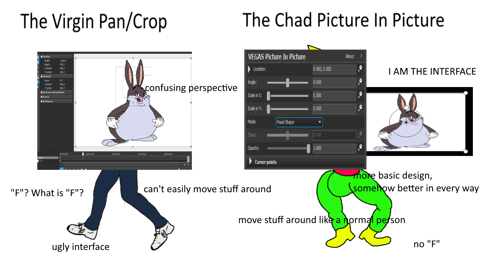

# Vegas-Scripts
NitroGuy's scripts for MAGIX VEGAS Pro 18.0 (although they should also work on previous versions)

---

### select_all_events_after_playhead.cs
Self-explanatory. Selects all clips to the right of the current playhead position.

### add_pnp_to_selected.cs
Adds a VEGAS Picture In Picture effect to all selected clips because screw Pan/Crop. Literally the weirdest and most confusing interface I've ever seen.

### add_pnp_to_selected_if_none.cs
Just like the previous one except it will not add a VEGAS Picture In Picture effect if a video clip already has one. Pick this one if you're gonna use this with Ctrl+A.

### [Vegas_ScreenShake](https://github.com/NitroGuy10/Vegas_ScreenShake)
Apply a "screen shake" or "camera shake" effect to video clips using, you guessed it, VEGAS Picture In Picture

---

